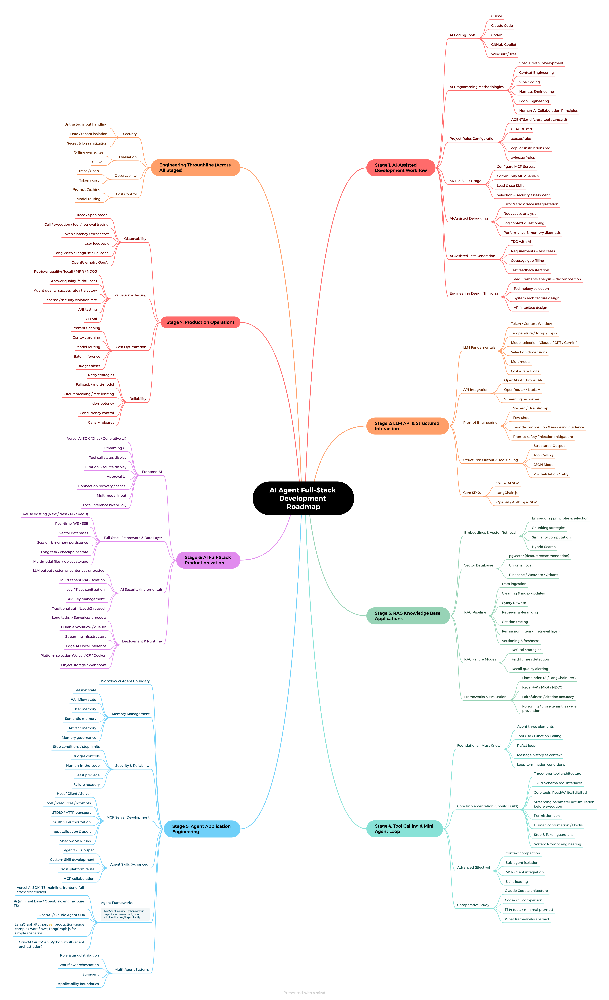

# AI Agent Full-Stack Development Roadmap

  

A comprehensive capability map for **Node.js & frontend developers** transitioning into AI Agent full-stack development. Covers the complete learning path from AI-assisted programming to Agent application engineering and production operations.

> By **五月君**, creator of the WeChat public account "Nodejs技术栈"　|　[中文版](./README.zh.md)

---

## Roadmap Overview

---

## How to Read This Roadmap

The 7 stages are designed to be followed **in order**, but you don't need to dive deep into everything. Use these tags to prioritize:

- 🟢 **Core Path** — AI-assisted development, LLM API, structured output, RAG, Agent Loop, full-stack deployment
- 🔵 **Engineering Throughline** — Security · Evaluation · Observability · Cost — runs through every stage
- 🟡 **Advanced Elective** — MCP development, Skills, sub-agents, multi-agent, local inference, minimal agent runtimes

---

## Stage Navigation

| # | Stage | Key Topics |
|:---:|-------|-------------|
| 1 | [AI-Assisted Development Workflow](./ROADMAP.md#stage-1-ai-assisted-development-workflow) | AI tools · methodologies · project rules · MCP & Skills · debugging & testing |
| 2 | [LLM API & Structured Interaction](./ROADMAP.md#stage-2-llm-api--structured-interaction) | LLM fundamentals · API integration · Prompt Engineering · structured output · SDKs |
| 3 | [RAG Knowledge Base Applications](./ROADMAP.md#stage-3-rag-knowledge-base-applications) | Embeddings · vector databases · RAG pipeline · failure modes · evaluation |
| 4 | [Tool Calling & Mini Agent Loop](./ROADMAP.md#stage-4-tool-calling--mini-agent-loop) | Agent fundamentals · ReAct · tool systems · permission models · comparative study |
| 5 | [Agent Application Engineering](./ROADMAP.md#stage-5-agent-application-engineering) | Workflow vs Agent · memory management · security · MCP server · Skills · frameworks |
| 6 | [AI Full-Stack Productionization](./ROADMAP.md#stage-6-ai-full-stack-productionization) | Frontend AI · full-stack & data layer · AI security · deployment & runtime |
| 7 | [Production Operations](./ROADMAP.md#stage-7-production-operations) | Observability · evaluation · cost optimization · reliability |

👉 **[Read the full Roadmap →](./ROADMAP.md)**

---

## Design Philosophy

- **Not a course syllabus** — no step-by-step tutorials
- **Not a tool ranking** — prioritizes stable concepts over hyped tools
- **A capability map** — shows what skills you need and their dependency relationships
- **For experienced Node.js/frontend developers** — assumes you already know databases, Redis, OAuth, Docker; focuses on the AI-specific additions

---

## Contributing

Issues and PRs are welcome!

See [CONTRIBUTING.md](./CONTRIBUTING.md) for details.

---

## License

This work is licensed under [Creative Commons Attribution 4.0 International](https://creativecommons.org/licenses/by/4.0/). You are free to share and adapt, even commercially, as long as you give appropriate credit (WeChat account "Nodejs技术栈" or the original repository).

---

## Author

**五月君** — WeChat "Nodejs技术栈"

- 🐙 GitHub: [qufei1993](https://github.com/qufei1993)
