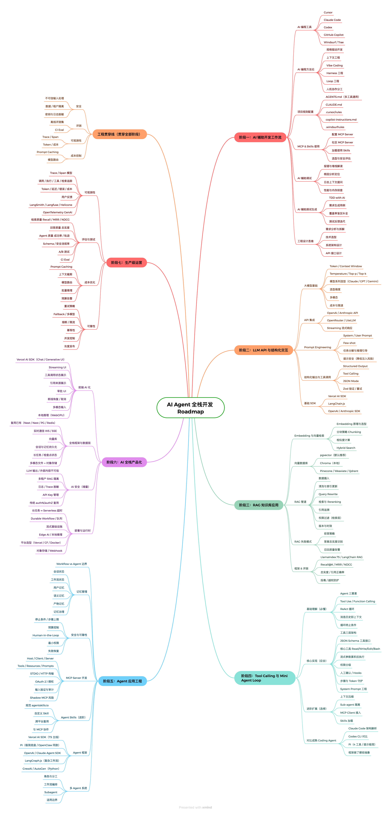

# AI Agent 全栈开发 Roadmap

  

面向 **Node.js / 前端开发者** 的 AI Agent 全栈开发能力地图。系统梳理从 AI 辅助编程到 Agent 应用工程化、再到生产级运营的完整学习路径。

> 公众号「**Nodejs技术栈**」出品　|　作者：五月君　|　[English](./README.md)

---

## Roadmap 全景图

---

## 如何阅读

7 个阶段建议**按顺序学**，但不必全部深挖。用标签做取舍：

- 🟢 **必学主线** — AI 辅助开发、LLM API、结构化输出、RAG、Agent Loop、全栈部署
- 🔵 **工程贯穿线** — 安全 · 评测 · 可观测性 · 成本（贯穿每个阶段，不是上线前才补）
- 🟡 **进阶选修** — MCP 开发、Skills、Sub-agent、多 Agent、本地推理、Pi 等极简底座

---

## 阶段导航

| 阶段 | 标题 | 核心内容 |
|:---:|------|----------|
| 一 | [AI 辅助开发工作流](./ROADMAP.zh.md#阶段一ai-辅助开发工作流) | AI 编程工具 · 方法论 · 规则配置 · MCP & Skills · 调试与测试 |
| 二 | [LLM API 与结构化交互](./ROADMAP.zh.md#阶段二llm-api-与结构化交互) | 大模型基础 · API 集成 · Prompt Engineering · 结构化输出 · SDK |
| 三 | [RAG 知识库应用](./ROADMAP.zh.md#阶段三rag-知识库应用) | Embedding · 向量数据库 · RAG 管道 · 失败模式 · 评测 |
| 四 | [Tool Calling 与 Mini Agent Loop](./ROADMAP.zh.md#阶段四tool-calling-与-mini-agent-loop) | Agent 三要素 · ReAct · 工具系统 · 权限模型 · 对比学习 |
| 五 | [Agent 应用工程](./ROADMAP.zh.md#阶段五agent-应用工程) | Workflow vs Agent · 记忆管理 · 安全可靠 · MCP · Skills · 框架 |
| 六 | [AI 全栈产品化](./ROADMAP.zh.md#阶段六ai-全栈产品化) | 前端 AI 化 · 全栈框架与数据层 · AI 安全 · 部署与运行时 |
| 七 | [生产级运营](./ROADMAP.zh.md#阶段七生产级运营) | 可观测性 · 评估测试 · 成本优化 · 可靠性 |

👉 **[阅读完整 Roadmap →](./ROADMAP.zh.md)**

---

## 设计理念

- **不是课程大纲** — 不提供"第 1 课做什么、第 2 课做什么"的线性教程
- **不是工具排行榜** — 不追求覆盖所有工具，不选"最火"，选"最稳、最能说明概念边界"
- **是能力地图** — 告诉你 AI Agent 全栈开发有哪些必须掌握的能力，以及它们之间的依赖关系
- **面向已经具备 Node.js/前端基础的开发者** — 传统全栈基础（DB/Redis/OAuth/Docker）默认你已掌握，本 Roadmap 聚焦 AI 增量部分

---

## 参与贡献

欢迎提 Issue 或 PR 来完善这份 Roadmap！

- 📝 **内容建议** — 发现遗漏、过时或表述不准确的技术点
- 🐛 **纠错** — 事实性错误、链接失效、措辞问题
- 💡 **讨论** — 不同工程实践的取舍与边界

详见 [CONTRIBUTING.md](./CONTRIBUTING.md)

---

## License

本作品采用 [Creative Commons Attribution 4.0 International](https://creativecommons.org/licenses/by/4.0/) 许可协议。

你可以自由地分享、修改、甚至商用，但**必须署名**并注明出处（公众号「Nodejs技术栈」或原始仓库链接）。

---

## 作者

**五月君** — 公众号「Nodejs技术栈」

- 📬 公众号：Nodejs技术栈
- 🐙 GitHub：[qufei1993](https://github.com/qufei1993)
